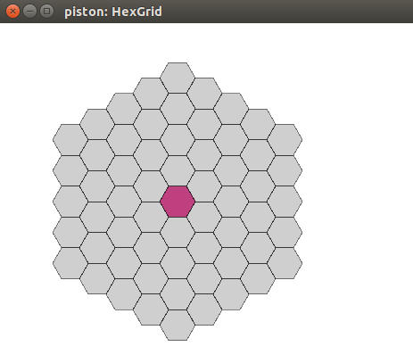

Tinkering. Making a hex grid for some type of game. Not really sure what the end result will look like, just having fun and learning.

Click a grid element to highlight(select) that hexagon.

Used [hex2d-rs](https://github.com/dpc/hex2d-rs) 

[Also, thanks to the guy who wrote this super useful article.](http://www.redblobgames.com/grids/hexagons/)

